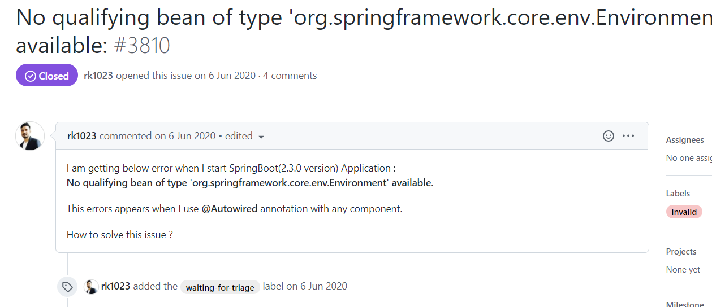

# dubbo实例搭建过程中遇到的问题

## 1、No qualifying bean of type 'org.springframework.core.env.Environment' available

报这个错是spring-boot的版本2.3.0.RELEASE就有这个问题，换成别的版本，如2.3.2.RELEASE就可以解决

参考 https://github.com/spring-cloud/spring-cloud-netflix/issues/3810



改前：

```xml
<spring-boot.version>2.3.0.RELEASE</spring-boot.version>

<dependency>
	<groupId>org.springframework.boot</groupId>
    <artifactId>spring-boot-dependencies</artifactId>
    <version>${spring-boot.version}</version>
    <type>pom</type>
    <scope>import</scope>
</dependency>
```


改后：

```xml
<spring-boot.version>2.3.2.RELEASE</spring-boot.version>

<dependency>
	<groupId>org.springframework.boot</groupId>
    <artifactId>spring-boot-dependencies</artifactId>
    <version>${spring-boot.version}</version>
    <type>pom</type>
    <scope>import</scope>
</dependency>
```

